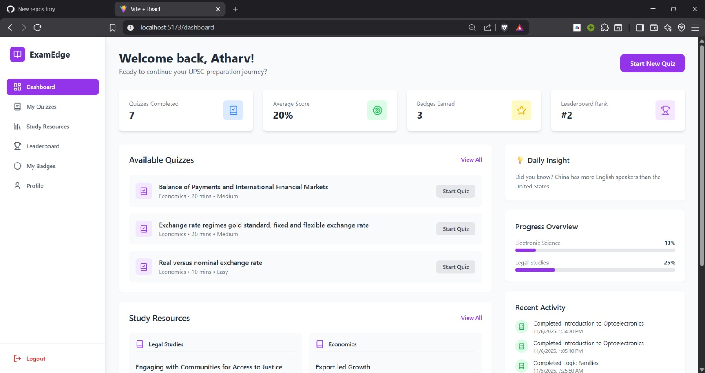
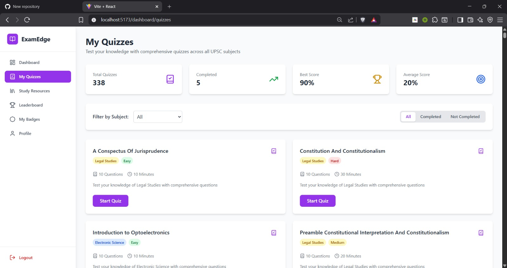
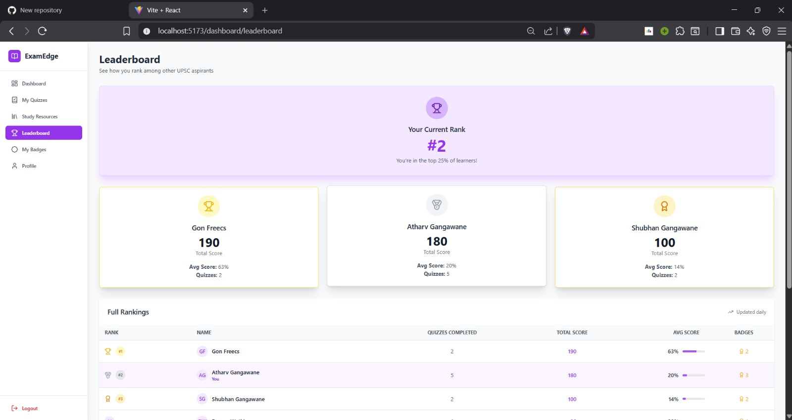
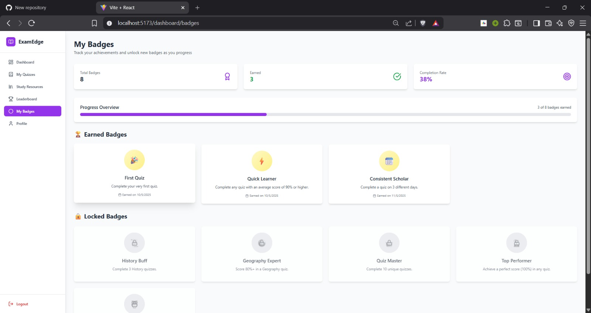
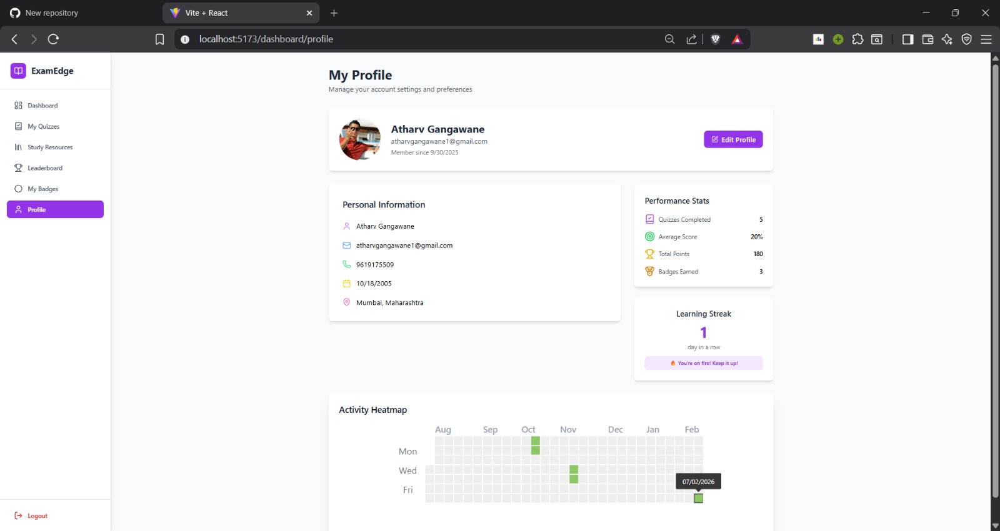
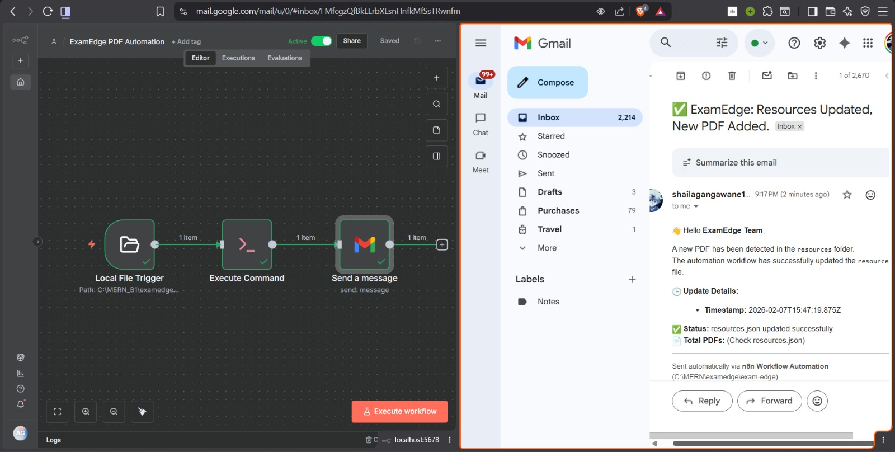
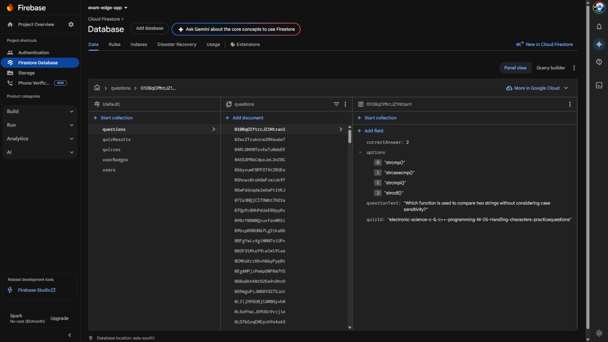

# 🎓 ExamEdge – Automated UPSC Preparation Platform

> 🏆 **Awarded "Best Project" - Sem 5 TEIT**

**ExamEdge** is a full-stack web application built to simplify and centralize UPSC exam preparation. The platform combines a **MERN-based frontend**, **Firebase authentication**, and a unique **automation-driven resource update pipeline** using **Python** and **n8n**.

The goal of ExamEdge is to reduce fragmentation in exam preparation by providing a single, structured platform for study resources, practice, and progress tracking.

---

## ✨ Features

### 🔐 User Authentication
- **Secure Access:** Powered by **Firebase Authentication**.
- **Session Management:** Robust email/password login with session persistence.
- **Security:** Protected routes ensuring data privacy for authenticated users.

### 📚 Resource Management
- **Digital Library:** Centralized repository organized by **Subjects** and **Topics**.
- **Scalable Design:** Supports locally mounted or externally hosted resources.
- **Smart Search:** Quickly filter materials by category.

### 🤖 Automation Pipeline (Unique Feature)
ExamEdge eliminates manual uploads using a smart automation pipeline:
- **n8n Workflows:** Actively monitor local folders for new PDFs.
- **Python Scripting:** Automatically parses metadata and updates the application database.
- **Instant Sync:** The frontend reflects new resources **without** manual redeployment.

### 🎯 Practice & Gamification
- **Topic-wise Quizzes:** Self-assessment modules for every subject.
- **Progress Tracking:** Visual analytics of user activity.
- **Leaderboard:** Real-time ranking system to encourage consistency.

---

## 🛠️ Technology Stack

| Domain | Tech Used |
| :--- | :--- |
| **Frontend** | React.js (Vite), Tailwind CSS |
| **Authentication** | Firebase Authentication (Google Sign-In) |
| **Resource Storage** | Local File System (PDF-based resources) |
| **Automation** | Python, n8n (Workflow Automation) |
| **Tools** | Git, GitHub, Firebase Console |


Note: The application does not use a traditional backend database or server. Firebase is used only for authentication, while study resources are stored locally to minimize operational costs.

---

## 🏗️ System Architecture

1.  **Frontend:** Communicates with the backend via REST APIs.
2.  **Auth:** Firebase handles secure authentication and token management.
3.  **Database:** MongoDB stores user profiles, quiz scores, and app state.
4.  **Automation:**
    * **n8n** triggers workflows upon file detection.
    * **Python** processes file metadata and updates the JSON registry.

---

## 📸 Screenshots

### 🖥️ Web Application

| **Dashboard** | **Quiz Interface** |
| :---: | :---: |
|  |  |

| **Study Resources** | **Leaderboard** |
| :---: | :---: |
|  |  |

| **Badges & Achievements** | **User Profile** |
| :---: | :---: |
|  |  |

---

### ⚙️ Automation & Backend Services

| **n8n Automation Workflow** | **Firebase Console** |
| :---: | :---: |
|  |  |


---

## 📁 Project Structure

```text
ExamEdge/
├── backend/                       # Backend services
│   ├── node_modules/
│   ├── migrate.py                 # Backend automation / migration script
│   ├── requirements.txt           # Python dependencies
│   ├── package.json
│   ├── package-lock.json
│   └── serviceAccountKey.json     # Firebase Admin SDK key (ignored)
│
├── public/                        # Public assets
│   ├── resources/                # Study resources (ignored from Git)
│   └── vite.svg
│
├── src/                           # React frontend
│   ├── assets/                    # Frontend static assets
│   ├── components/                # Reusable UI components
│   ├── context/                   # Global state & auth context
│   ├── data/                      # Static / mock data
│   ├── pages/                     # Application pages
│   ├── App.jsx
│   ├── Firebase.jsx               # Firebase client configuration
│   ├── index.css
│   └── main.jsx
│
├── generate_resources.py          # Resource indexing / automation script
├── .env                           # Environment variables (ignored)
├── .gitignore
├── eslint.config.js
├── index.html
├── package.json
├── package-lock.json
├── postcss.config.js
├── LICENSE
└── README.md
```

---

## 🚀 Getting Started

### Prerequisites
* **Node.js** (v18 or higher)
* **MongoDB** (Local or Atlas)
* **Firebase Project** (for Auth credentials)
* **Python 3.x** (for automation scripts)

### Installation

1.  **Clone the Repository**
    ```bash
    git clone [https://github.com/thisisAtharv/ExamEdge.git](https://github.com/thisisAtharv/ExamEdge.git)
    cd ExamEdge
    ```

2.  **Install Dependencies**
    ```bash
    # Install Root/Frontend dependencies
    npm install

    # Install Backend dependencies
    cd backend
    npm install
    cd ..
    ```

3.  **Environment Setup**
    This project uses separate credentials for the frontend and backend configuration.

    **Frontend Environment Variables**
    Create a `.env` file in the **root** directory of the project:
    ```env
    VITE_GOOGLE_CLIENT_ID=your_google_client_id
    VITE_FIREBASE_API_KEY=your_api_key
    VITE_FIREBASE_AUTH_DOMAIN=your_project_id.firebaseapp.com
    VITE_FIREBASE_PROJECT_ID=your_project_id
    VITE_FIREBASE_STORAGE_BUCKET=your_project_id.appspot.com
    VITE_FIREBASE_MESSAGING_SENDER_ID=your_sender_id
    VITE_FIREBASE_APP_ID=your_app_id
    ```
    > **Note:** These values are used by the React frontend for authentication and Firebase integration. All variables prefixed with `VITE_` are exposed to the client and are safe to use.

    **Backend Configuration (Firebase Admin SDK)**
    The backend uses a Firebase service account key for admin-level operations.

    1.  **Download** the service account JSON file from the [Firebase Console](https://console.firebase.google.com/) (Project Settings > Service Accounts).
    2.  **Place** the file inside the backend directory:
        ```text
        backend/serviceAccountKey.json
        ```
    3.  **Secure** the file by ensuring it is listed in your `.gitignore` to exclude it from version control:
        ```gitignore
        backend/serviceAccountKey.json
        ```

4.  **Run the Application**
    ```bash
    npm run dev
    ```

---

## 🧠 Learning Outcomes
* Building a scalable **Full-Stack MERN application**.
* Integrating third-party services like **Firebase** for secure authentication.
* Designing complex **Automation Workflows** using **n8n**.
* Implementing **Role-Based Access Control (RBAC)** basics.

---

## 🔮 Future Enhancements
* ☁️ **Cloud Storage:** Migration of local PDFs to AWS S3 / Firebase Storage.
* 📊 **Advanced Analytics:** AI-driven insights on user performance.
* 📱 **Mobile Responsiveness:** Enhanced UI for mobile devices.

---

## 📝 License
This project is licensed under the MIT License.

---
